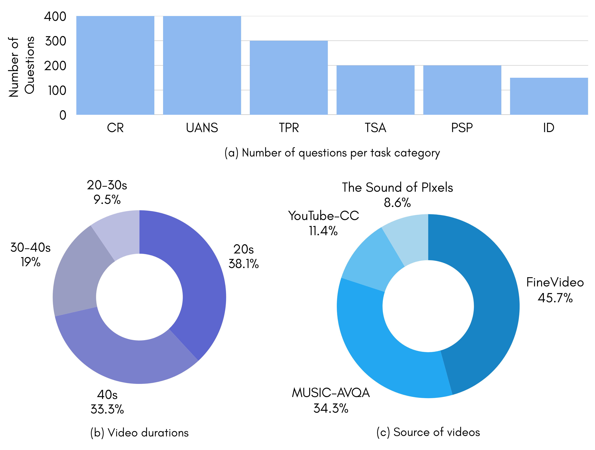
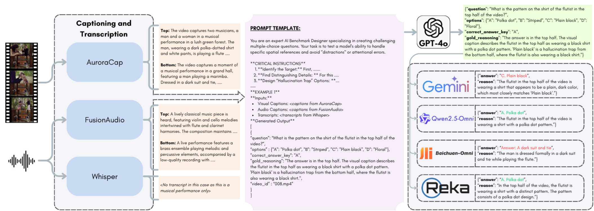
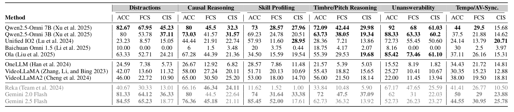

<div align="center">
  <h1>AURA: A Fine-Grained Benchmark and Decomposed Metric for Audio-Visual Reasoning</h1>
  <h2><i>(Pre-Print)</i></h2>
</div>
  
<!-- **Authors:** -->

<div align="center">
  
<b>_[Siminfar Samakoush Galouga](#) <sup>1*</sup> , [Rishie Raj](https://www.linkedin.com/in/rishieraj/) <sup>1*</sup>, [Sanjoy Chowdhury](https://schowdhury671.github.io/) <sup>1</sup>, [Sayan Nag](https://sayannag.github.io/) <sup>2</sup>,_</b>

**_[Ramani Duraiswami](https://users.umiacs.umd.edu/~ramanid/) <sup>1</sup>_**

<!-- **Affiliations:** -->

_<sup>1</sup> University of Maryland, <sup>2</sup> Adobe Research_
</div>

## TL;DR
We present AURA, the first question-answering (QA) benchmark designed to evaluate state-of-the-art Audio-Visual Large Language Models (AV-LLMs) and Omni-Modal Language Models (OLMs) on fine-grained cognitive tasks, including Cross-Modal Causal Reasoning, Timbre/Pitch Reasoning, Tempo/AV Synchronization Analysis, Unanswerability, Implicit Distractions, and Performer Skill Profiling.

<div align="center">
  📰 <a href="#" style="color: black; text-decoration: underline;text-decoration-style: dotted;">Paper</a>   🗃️  <a href="https://drive.google.com/drive/folders/1ua93_3XyDAZZ6arGQij7OqAZR3UO5pZW?usp=drive_link" style="color: black; text-decoration: underline;text-decoration-style: dotted;">Dataset</a>   🌐  <a href="https://rishieraj.github.io/aura-project-page/" style="color: black; text-decoration: underline;text-decoration-style: dotted;">Project Page</a>   🧱   <a href="https://github.com/rishieraj/aura.git" style="color: black; text-decoration: underline;text-decoration-style: dotted;">Code</a>
</div>


## Table of Contents 📚

- [Benchmark Statistics](#aura-benchmark-statistics-)
- [Task Examples](#aura-task-examples-)
- [Architecture and Usage](#aura-qa-generation-architecture-and-usage-️)
- [Results](#results-)
- [Dataset](#dataset-)

## Benchmark Statistics 📊
<div align="center">
  
</div>


## Task Examples 🧠
<div align="center">
  
</div>


## QA Generation Architecture 🛠️
<div align="center">
  
</div>

## Results 📉
<div align="center">
  
</div>

## Dataset 📁
Please download the dataset JSONs from here: <a href="https://drive.google.com/drive/folders/1ua93_3XyDAZZ6arGQij7OqAZR3UO5pZW?usp=drive_link"> Link </a>


## Setup 🚀

In order to use the QA generation pipeline on custom video data, audio captions, video captions and transcripts (*only for the CR and UANS tasks*) would be required for the QA-pair generation scripts. While we used the following models for captioning and transcription in **AURA**, the modular nature of the pipeline allows for any model of choice to be used for these purposes.

- Video Captions: [AuroraCap]()
- Audio Captions: [FusionAudio]()
- Transcripts: [Whisper]()

Once the captions and transcripts are obtained, please follow the following instructions to generate the QA-pairs

### 1. Installation

```bash
# Clone the repository
git clone https://github.com/yourusername/causal-qa-generator.git
cd causal-qa-generator

# Install dependencies
pip install -r requirements.txt

# Set your OpenAI API key
export OPENAI_API_KEY='your-api-key-here'
```

### 2. Prepare Your Data

Create the following directory structure:

```
causal_reasoning_data/
├── transcripts/         # Speech-to-text transcripts
│   ├── video001.txt
│   ├── video002.txt
│   └── ...
├── visual_captions/     # Visual scene descriptions
│   ├── video001.txt
│   ├── video002.txt
│   └── ...
└── audio_captions/      # Audio-only descriptions
    ├── video001.txt
    ├── video002.txt
    └── ...
```
**Important:** Each video clip must have matching filenames across all three directories.

### 3. Run the Generator

```bash
# Using default settings
python causal_qa.py

# With custom data directory
python causal_qa.py --data-dir ./my_data --output-dir ./my_output

# Using a different model with higher temperature
python causal_qa.py --model gpt-4o-mini --temp 0.7
```

### 4. Evaluation

```bash
# Basic usage
python evaluation.py --input gemini_responses.jsonl --output gemini_evaluation.jsonl --model-key gemini_2.0_flash

# With custom settings
python evaluation.py --input qwen2.5_responses.jsonl --output qwen2.5_eval.jsonl --model-key qwen2.5 --temperature 0.2 --sleep-between 2.0
```

## Data Format 📁

### Input Files

Each `.txt` file should contain plain text descriptions:

- **Transcripts** (`transcripts/`): Speech-to-text output from the video
- **Visual Captions** (`visual_captions/`): Description of what's visually happening
- **Audio Captions** (`audio_captions/`): Description of audio elements (speech, music, sounds)

### Example Input

**video001.txt** in `visual_captions/`:
```
A person is carefully attaching a white panel to a bright yellow canopy structure using a series of black clamps.
```

**video001.txt** in `audio_captions/`:
```
a man is speaking with background noise
```

**video001.txt** in `transcripts/`:
```
After this, you will need to connect the top velcro to the frame. This ensures that the top stays taught and all water runs off easily.
```

### Output Format

The tool generates a JSONL file (`questions/qa_pairs.jsonl`) with this structure:

```json
{
  "question": "What is the underlying reason for securing the panel to the yellow canopy?",
  "options": {
    "A": "To add a final decorative touch to the canopy.",
    "B": "To make the canopy top taut and ensure water runs off.",
    "C": "To perform a necessary repair on a broken frame section.",
    "D": "To demonstrate how to use clamps for a general purpose."
  },
  "correct_answer_key": "B",
  "gold_reasoning": "The visual action of attaching the panel is directly explained by the speaker's instructions...",
  "video_id": "video001",
  "category": "causal_reasoning"
}
```


## TO-DO 📝
- [ ] Setup Procedure
- [ ] Upload Dataset


## Citation

```bibtex

```